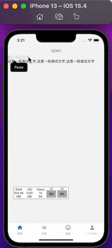

# rn-text-highlight

### Installation

```bash
npm i rn-text-highlight
```

## base useage

```js
<RnTextHighlight originText={employeeName} keyword={keyword} />
```

## demo gif


## Available props

| Name         | Type     | Default         | Description      |
| ------------ | -------- | --------------- | ---------------- |
| originText   | `string` | `-`             | The default text |
| keyword      | `string` | `-`             | keyword          |
| keywordStyle | `Object` | `color: "#f40"` | keyword style    |
| textStyle    | `Object` | `-`             | text style       |
